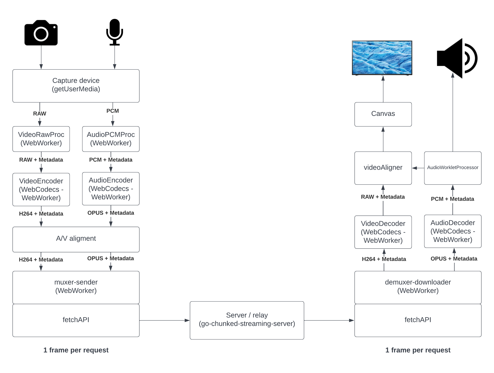

# webcodecs-capture-play

This project is provides a minimal implementation (inside the browser) of a live video and audio encoder and video / audio player. The goal is to provide a minimal live platform implementation that helps learning low latency trade offs, and facilitates low latency experimentation.


Fig1: Main block diagram

The encoder and player uses [Webcodecs](https://developer.mozilla.org/en-US/docs/Web/API/WebCodecs_API) and [AudioContext](https://developer.mozilla.org/en-US/docs/Web/API/AudioContext) / [Worklet](https://developer.mozilla.org/en-US/docs/Web/API/Worklet).

For the server/relay side we have used [go-chunked-streaming-server](https://github.com/mjneil/go-chunked-streaming-server), a server that we developed with some colleagues specifically for livestreaming testing

## Encoder
The encoder is based on [Webcodecs](https://developer.mozilla.org/en-US/docs/Web/API/WebCodecs_API), and [AudioContext](https://developer.mozilla.org/en-US/docs/Web/API/AudioContext), the signal flow is the one you can see in fig2

Note: We have used [Fetch API](https://developer.mozilla.org/en-US/docs/Web/API/Fetch_API) for to send data to the server / relay, but the final goal is to replace it for [WebTransport](https://www.w3.org/TR/webtransport/) and use QUIC as a transport level protocol (learn more about it in [moq IETF workgroup](https://datatracker.ietf.org/doc/charter-ietf-moq/))

### Config params

Video encoding config:
```
// Video encoder config
const videoEncoderConfig = {
    encoderConfig: {
        codec: 'avc1.42001e', // Baseline = 66, level 30 (see: https://en.wikipedia.org/wiki/Advanced_Video_Coding)
        width: 640,
        height: 480,
        bitrate: 2_000_000, // 2 Mbps
        framerate: 30,
        latencyMode: 'realtime', // Sends 1 chunk per frame
    },
    encoderMaxQueueSize: 2,
    keyframeEvery: 60,
};
```

Audio encoder config:
```
// Audio encoder config
const audioEncoderConfig = {
    encoderConfig: {
        codec: 'opus', // AAC NOT implemented YET (it is in their roadmap)
        sampleRate: 48000, // To fill later
        numberOfChannels: 1, // To fill later
        bitrate: 32000,
    },
    encoderMaxQueueSize: 10,
};
```

Muxer config:
```
const muxerSenderConfig = {
    audioMaxMaxQueueSizeMs: 200,
    videoMaxMaxQueueSizeMs: 100,

    maxInFlightRequests: 20,

    urlHostPort: '',
    urlPath: '',

    maxAgeChunkS: 120,
}
```

### src_encoder/index.html
Main encoder webpage and also glues all encoder pieces together

- When it receives an audio OR video raw frame from `a_capture` or `v_capture`:
  - Adds it into `TimeChecker`
  - Sends it to encoder

- When it receives an audio OR video encoded chunk from `a_encoder` or `v_encoder`:
  - Gets the wall clock generation time of 1st frame in the chunk
  - Sends the chunk (augmented with wall clock, seqId, and metadata) to the muxer

### src_encoder/TimeChecker
Stores the frames timestamps and the wall clock generation time from the raw generated frames. That allows us keep track of each frame / chunk creation time (wall clock)

### src_encoder/v_capture.js
[WebWorker](https://developer.mozilla.org/en-US/docs/Web/API/Web_Workers_API) that waits for the next RGB or YUV video frame from capture device,  augments it adding wallclock, and sends it via post message to video encoder

### src_encoder/a_capture.js
[WebWorker](https://developer.mozilla.org/en-US/docs/Web/API/Web_Workers_API) Receives the audio PCM frame (few ms, ~10ms to 25ms of audio samples) from capture device, augments it adding wallclock, and finally send it (doing copy) via post message to audio encoder

### src_encoder/v_encoder.js
[WebWorker](https://developer.mozilla.org/en-US/docs/Web/API/Web_Workers_API) Encodes RGB or YUV video frames into encoded video chunks
- configures the `VideoEncoder` in `realtime` latency mode, so it delivers a chunk per video frame
- Receives the video RGB or YUV frame from v_capture.js
- Adds the video frame to a queue. And it keeps teh queue smaller than `encodeQueueSize`. It helps when encoder is overwhelmed
- Specifies I frames based on config var `keyframeEvery`
- It receives a chunk and delivers it to the next stage (muxer)

### src_encoder/a_encoder.js
[WebWorker](https://developer.mozilla.org/en-US/docs/Web/API/Web_Workers_API) Encodes PCM audio frames (samples) into encoded audio chunks
- Configures the `AudioEncoder`, it delivers a chunk per audio frame
- Receives the audio PCM frame from a_capture.js
- Adds the audio frame to a queue. And it keeps the queue smaller than `encodeQueueSize`. It helps when encoder is overwhelmed
- It receives the chunk and delivers it to the next stage (muxer)

### src_encoder/muxer_sender.js
[WebWorker](https://developer.mozilla.org/en-US/docs/Web/API/Web_Workers_API) Sends audio and video chunks to the server / relay
- Receives audio and video chunks from `a_encoder.js` and `v_encoder.js`
- Keeps 2 queues of chunks (one per audio other per video)
- For audio: If we try to add a chunk and the queue is over configured size `audioMaxMaxQueueSizeMs` it drops the 1st element on the queue
- For video: If we try to add a chunk and the queue is over configured size `videoMaxMaxQueueSizeMs` it drops ALL the queue and continues dropping until we get a key frame. I also waits for `videoPenaltyAudioSentFrames` audio frames to be sent before adding a new video frame the video queue
- It continously send audio and video chunk, audio is always sent first if there are any in the audio queue. In other words it only sends video when **audio sending queue is empty**
- It keeps number of inflight requests always below configured value `maxInFlightRequest` (Whatch out: Browsers also limits those)
- When sending chunks adds the following metadata as headers:
```
Content-Type: application/octet-stream
Cache-Control: max-age: Indicates server to cache this data for `maxAgeChunkS` (except init segments)

Joc-Media-Type: Indicates if this chunk is video or audio
Joc-Timestamp: Timestamp that comes from capture via encoder
Joc-Chunk-Type: Chunk type from encoder (delta ot key)
Joc-Seq-Id: Increasing number that indicates the chunk order inside the mediatype, it comes from the encoder. I can have gaps if we drop chunks / frames before this point
Joc-First-Frame-Clk: Wall clock (epoch ms) when the 1st frame of this chunk was generated
Joc-Uniq-Id: Unique ID for the request
```

## Player
The player is based on [Webcodecs](https://developer.mozilla.org/en-US/docs/Web/API/WebCodecs_API), [AudioContext](https://developer.mozilla.org/en-US/docs/Web/API/AudioContext), and [Worklet](https://developer.mozilla.org/en-US/docs/Web/API/Worklet). The signal flow is the one you can see in fig3

Note: We have used [Fetch API](https://developer.mozilla.org/en-US/docs/Web/API/Fetch_API) for this component but the final goal is to replace it for [WebTransport](https://www.w3.org/TR/webtransport/)

### Audio video sync strategy
To keep the audio and video in-sync, following strategy is applied:
- Audio renderer (`source_buffer_worklet.js`) keeps track of last played timestamp (deliverd to audio device) by using PTS value in the current playing `AudioData` frame and adding the duration of the number of samples delivered. This information is accessible from player page via `timingInfo.renderer.currentAudioTS`, who also adds the hardware latency provided by `AudioContext`. 
- Every time we sent new audio samples to audio renderer the video renderer `video_render_buffer` (who contains YUV/RGB frames + timestamps) gets called and:
  - Returns / paints the oldest closest (or equal) frame to current audio ts (`timingInfo.renderer.currentAudioTS`)
  - Discards (frees) all frames older current ts (except the retuened one)

### src-player/muxer_downloader.js
[WebWorker](https://developer.mozilla.org/en-US/docs/Web/API/Web_Workers_API) downloads video and audio data from the server. The secuence of actions are:
- Downloads audio and video init chunks
- Ask for the audio and video chunk (EDGE - desired buffer), ask for the 2 requests in parallel
  - In this case the server will reply with the chunk with the 1st frame wall clock closest to the edge - desired buffer (it needs [go-chunked-streaming-server](https://github.com/mjneil/go-chunked-streaming-server), this is custom server functionality)
  - It will get the seqId of the returned segment from the headers
- (recursive) For audio and video will continue downloading chunk (seqId++)
  - IF the chunk is NOT in the server, the server will block the request for `targetBufferS`, and it will start returning (chunked-transfer) when the 1st byte arrives to the server or 404 if that chunk does NOT start arriving in the desired time frame (it needs [go-chunked-streaming-server](https://github.com/mjneil/go-chunked-streaming-server), this is custom server functionality)
- Send downloaded chunk to main player processor
- In case there is an error downloading a chunk indicates discontiuity and asks again for  edge - desired buffer

### src-player/audio_decoder.js
[WebWorker](https://developer.mozilla.org/en-US/docs/Web/API/Web_Workers_API) when it receives and audio chunk it decodes it and it sends the audio PCM samples to the audio renderer 

### src-player/source_buffer_worklet.js
[AudioWorkletProcessor](https://developer.mozilla.org/en-US/docs/Web/API/Web_Workers_API), implements an audio source Worklet.
- When it receives audio raw samples it transfers them into internal buffer
- The samples in the internal buffer are played at samplimg freq rate
  - In case the buffer is exhausted (underrun) it will insert silence samples and notify play timing according to that. This will help keeping audio and video in sync

### src-player/video_decoder.js
[WebWorker](https://developer.mozilla.org/en-US/docs/Web/API/Web_Workers_API), Decodes video chunks and sends the decoded data (YUV or RGB) to the next stage (`video_render_buffer.js`)
- Initilizes video decoder with init segment
- Sends video chunks to video decoder
  - If it detects a discontinuyty drops all video frames until next IDR frame
- Sends the decoded frame to `video_render_buffer.js`

### src-player/video_render_buffer.js
Buffer that stores video decoded frames
- Received video decoded frames
- Allows the retrival of video decoded frames via timestamps
  - Automatically drops all video frames with smaller timestamps than the requested one


### Config params

```
const downloaderConfig = {
    targetBufferS: 1, // Target player buffer size, we will request EDGE - this value

    urlHostPort: '',
    urlPath: '',
}
```

# Testing

- Clone this repo
```
git clone git@github.com:jordicenzano/webcodecs-capture-play.git
```
- Install [go-chunked-streaming-server](https://github.com/mjneil/go-chunked-streaming-server) locally (or in a cloud instance), follow the instructions there
- Checkout `feature/live-stream-timming-options` branch
```
cd go-chunked-streaming-server
git checkout feature/live-stream-timming-options
```
- Compile webserver
```
make
```
- Start server with the following options. It is basically enabling CORS for all methods and headers used, not saving info to disc (just using RAM), waiting for specific time before returning 404 (specified in GET header `Expires: in=`), removes files after expiration (based on `Cache-Control: max-age=`)
```
bin/go-chunked-streaming-server -o ./examples/cors-example.json -r -d -w -t
```
- Install a local webserver, for instance [http-server](https://www.npmjs.com/package/http-server)

- Execute the local webServer (to serve encoder and player webpages)
```
cd webcodecs-capture-play
http-server
```
- Load encoder webpage, url: `http://localhost:8080/src-encoder/`
  - Click "start"
- Load player webpage, url: `http://localhost:8080/src-player/`
  - Copy `StreamID` from encoder webpage and paste it into Receiver demuxer - streamID
  - Click "start"

ENJOY YOUR POCing!!! :-)