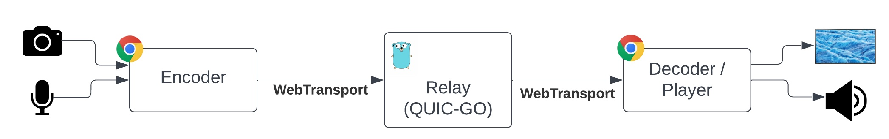
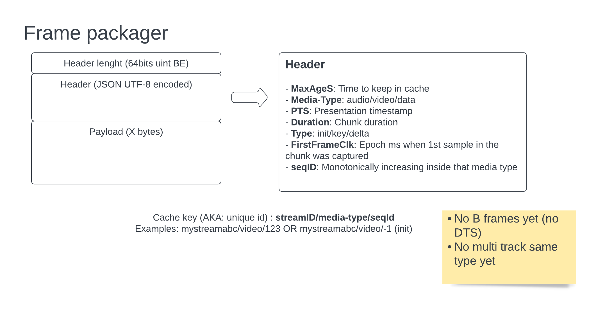
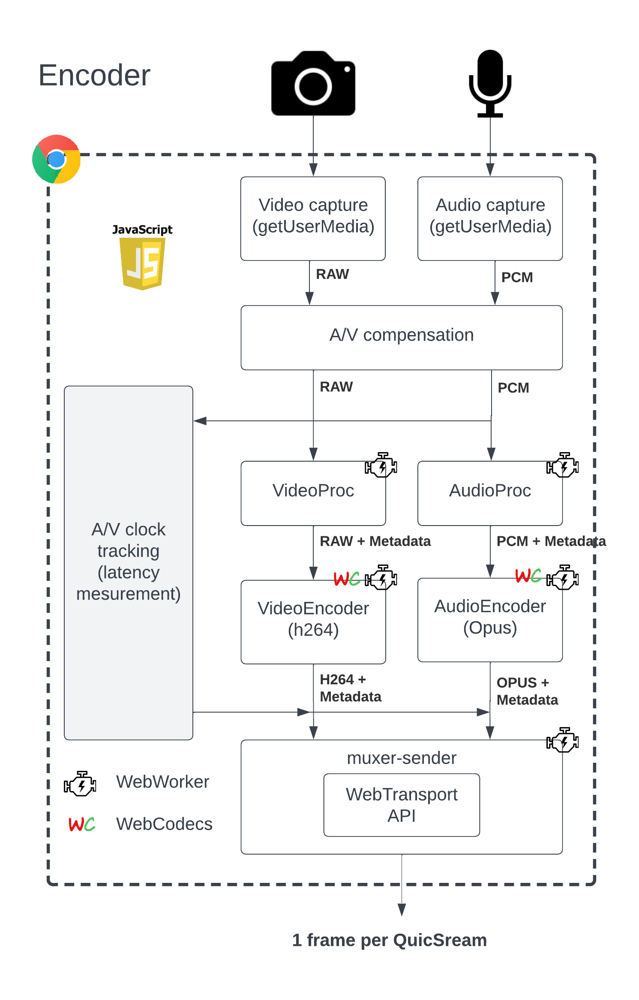
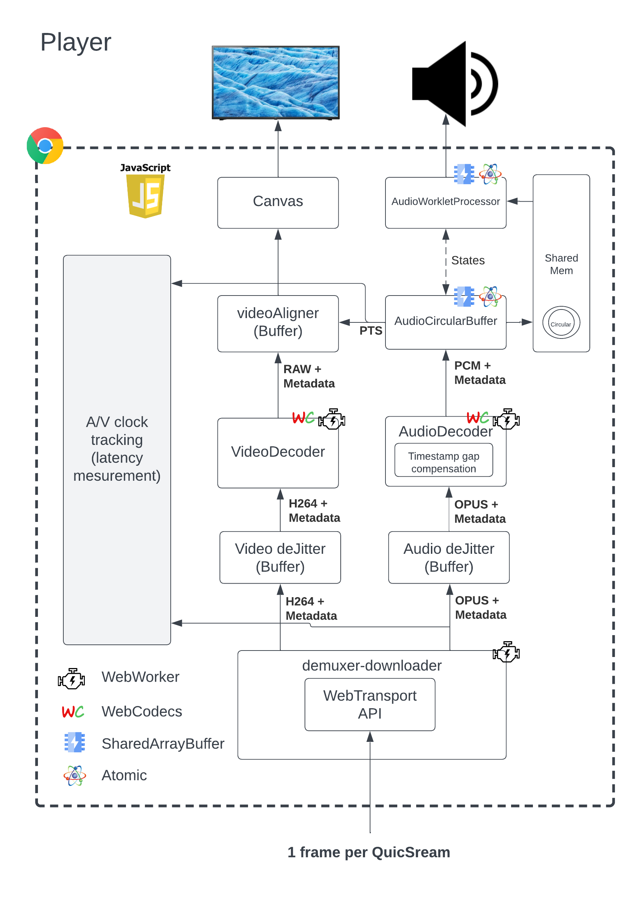
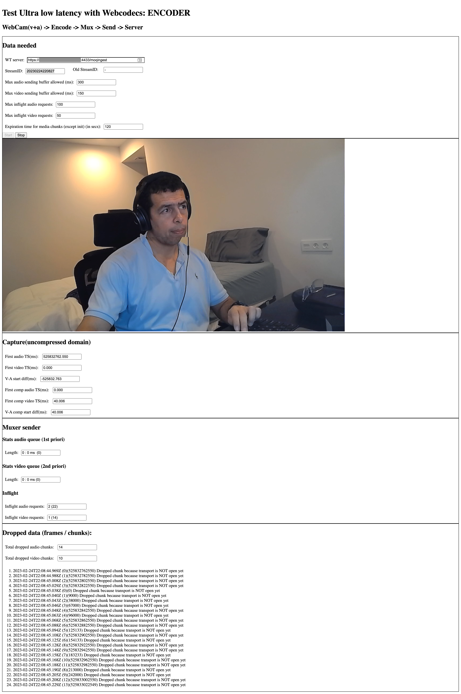
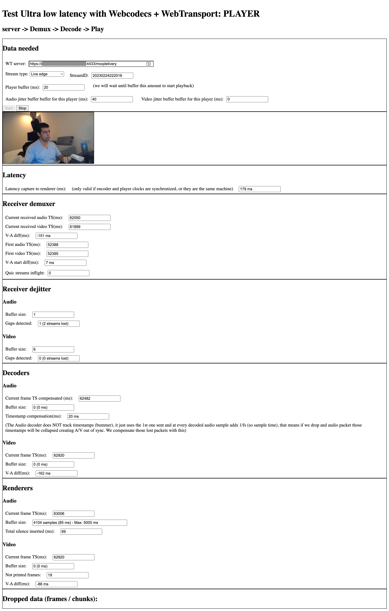

# webcodecs-capture-play
This project is provides a minimal implementation (inside the browser) of a live video and audio encoder and video / audio player. The goal is to provide a minimal live platform implementation that helps learning low latency trade offs, and facilitates low latency experimentation.

We also used it to start experimenting in media over QUIC transport (learn more about it in [moq IETF workgroup](https://datatracker.ietf.org/doc/charter-ietf-moq/))


Fig1: Main block diagram

For the server/relay side we have used [go-media-webtransport-server](https://github.com/jordicenzano/go-media-webtransport-server), a server that we developed media serving purposes using QUIC as underlying transport

## Packager
We use a very experimental, flexible, and NON optimal packager that we created for specifically for this, see fig2


Fig2: Media packager

## Encoder
The encoder is based on [Webcodecs](https://developer.mozilla.org/en-US/docs/Web/API/WebCodecs_API), and [AudioContext](https://developer.mozilla.org/en-US/docs/Web/API/AudioContext), see the block diagram in fig3


Fig3: Encoder block diagram

Note: We have used [WebTransport](https://www.w3.org/TR/webtransport/), so the underlying transport is QUIC, QUIC streams to be more accurate

### Config params
Video encoding config:
```
// Video encoder config
const videoEncoderConfig = {
  encoderConfig: {
    codec: 'avc1.42001e', // Baseline = 66, level 30 (see: https://en.wikipedia.org/wiki/Advanced_Video_Coding)
    width: 640,
    height: 480,
    bitrate: 2_000_000, // 2 Mbps
    framerate: 30,
    latencyMode: 'realtime', // Sends 1 chunk per frame
  },
  encoderMaxQueueSize: 2,
  keyframeEvery: 60,
};
```

Audio encoder config:
```
// Audio encoder config
const audioEncoderConfig = {
  encoderConfig: {
    codec: 'opus', // AAC NOT implemented at the time I wrote this (it is in their roadmap)
    sampleRate: 48000,
    numberOfChannels: 1,
    bitrate: 32000,
  },
  encoderMaxQueueSize: 10,
};
```

Muxer config:
```
const muxerSenderConfig = {
  audioMaxMaxQueueSizeMs: 200,
  videoMaxMaxQueueSizeMs: 100,

  maxInFlightAudioRequests: 100,
  maxInFlightVideoRequests: 50,

  urlHostPort: '',
  urlPath: '',

  maxAgeChunkS: 120,
}
```

### src_encoder/index.html
Main encoder webpage and also glues all encoder pieces together

- When it receives an audio OR video raw frame from `a_capture` or `v_capture`:
  - Adds it into `TimeChecker`
  - Sends it to encoder

- When it receives an audio OR video encoded chunk from `a_encoder` or `v_encoder`:
  - Gets the wall clock generation time of 1st frame in the chunk
  - Sends the chunk (augmented with wall clock, seqId, and metadata) to the muxer

### utils/TimeChecker
Stores the frames timestamps and the wall clock generation time from the raw generated frames. That allows us keep track of each frame / chunk creation time (wall clock)

### src_encoder/v_capture.js
[WebWorker](https://developer.mozilla.org/en-US/docs/Web/API/Web_Workers_API) that waits for the next RGB or YUV video frame from capture device,  augments it adding wallclock, and sends it via post message to video encoder

### src_encoder/a_capture.js
[WebWorker](https://developer.mozilla.org/en-US/docs/Web/API/Web_Workers_API) Receives the audio PCM frame (few ms, ~10ms to 25ms of audio samples) from capture device, augments it adding wallclock, and finally send it (doing copy) via post message to audio encoder

### src_encoder/v_encoder.js
[WebWorker](https://developer.mozilla.org/en-US/docs/Web/API/Web_Workers_API) Encodes RGB or YUV video frames into encoded video chunks
- configures the `VideoEncoder` in `realtime` latency mode, so it delivers a chunk per video frame
- Receives the video RGB or YUV frame from `v_capture.js`
- Adds the video frame to a queue. And it keeps teh queue smaller than `encodeQueueSize`. It helps when encoder is overwhelmed
- Specifies I frames based on config var `keyframeEvery`
- It receives a chunk and delivers it to the next stage (muxer)

### src_encoder/a_encoder.js
[WebWorker](https://developer.mozilla.org/en-US/docs/Web/API/Web_Workers_API) Encodes PCM audio frames (samples) into encoded audio chunks
- Configures the `AudioEncoder`, it delivers a chunk per audio frame
- Receives the audio PCM frame from a_capture.js
- Adds the audio frame to a queue. And it keeps the queue smaller than `encodeQueueSize`. It helps when encoder is overwhelmed
- It receives the chunk and delivers it to the next stage (muxer)

### src_encoder/muxer_sender.js
[WebWorker](https://developer.mozilla.org/en-US/docs/Web/API/Web_Workers_API) Sends audio and video chunks to the server / relay
- Opens a WebTransport session against the server
- Creates a Unidirectional (encoder -> server) QUIC stream per every frame
- Receives audio and video chunks from `a_encoder.js` and `v_encoder.js`
- Keeps 2 queues of chunks (one per audio other per video)
- For audio: If we try to add a chunk and the queue is over configured size `audioMaxMaxQueueSizeMs` it drops the 1st element on the queue
- For video: If we try to add a chunk and the queue is over configured size `videoMaxMaxQueueSizeMs` it drops ALL the queue and continues dropping until we get a key frame. I also waits for `videoPenaltyAudioSentFrames` audio frames to be sent before adding a new video frame the video queue
- It continuously send audio and video chunk, audio is always sent first if there are any in the audio queue. In other words it only sends video when **audio sending queue is empty**
- It keeps number of inflight requests always below configured value `maxInFlightRequest`
- When sending chunks adds the following metadata as inside header fields:
```
'Cache-Control': max-age=AA`, // Indicates server to cache this data for AA seconds (except init segments)
'Joc-Media-Type': mediaType, // audio, video, or data
'Joc-Timestamp': timestamp, // Chunk PTS in nanoseconds
'Joc-Duration': duration, // Duration in nanoseconds
'Joc-Chunk-Type': chunkType, // key, delta, init
'Joc-Seq-Id': seqId, // Unique and monotonically increasing inside specific media type track
'Joc-First-Frame-Clk': firstFrameClkms, // EPOCH ms when the 1st sample in that chunk was captured
'Joc-Uniq-Id': pId, // Unique request ID (not used)
```

## Player
The player uses [Webcodecs](https://developer.mozilla.org/en-US/docs/Web/API/WebCodecs_API) and [AudioContext](https://developer.mozilla.org/en-US/docs/Web/API/AudioContext) / [Worklet](https://developer.mozilla.org/en-US/docs/Web/API/Worklet), [SharedArrayBuffer](https://developer.mozilla.org/en-US/docs/Web/JavaScript/Reference/Global_Objects/SharedArrayBuffer), and [Atomic](https://developer.mozilla.org/en-US/docs/Web/JavaScript/Reference/Global_Objects/Atomics)

Note: We have used [WebTransport](https://www.w3.org/TR/webtransport/), so the underlying transport is QUIC, quicStreams to be more accurate


Fig4: Player block diagram

### Audio video sync strategy
To keep the audio and video in-sync, following strategy is applied:
- Audio renderer (`audio_circular_buffer.js`) keeps track of last played timestamp (delivered to audio device by `source_buffer_worklet.js`) by using PTS value in the current playing `AudioData` frame and adding the duration of the number of samples delivered. This information is accessible from player page via `timingInfo.renderer.currentAudioTS`, who also adds the hardware latency provided by `AudioContext`. 
- Every time we sent new audio samples to audio renderer the video renderer `video_render_buffer` (who contains YUV/RGB frames + timestamps) gets called and:
  - Returns / paints the oldest closest (or equal) frame to current audio ts (`timingInfo.renderer.currentAudioTS`)
  - Discards (frees) all frames older current ts (except the returned one)
- It is worth saying that `AudioDecoder` does NOT track timestamps, it just uses the 1st one sent and at every decoded audio sample adds 1/fs (so sample time). That means if we drop and audio packet those timestamps will be collapsed creating A/V out of sync. To workaround that problem we calculate all the audio GAPs duration `timestampOffset` (by last playedTS - newTS, ideally = 0 if NO gaps), and we compensate the issued PTS by that. 


### src-player/demuxer_downloader.js
[WebWorker](https://developer.mozilla.org/en-US/docs/Web/API/Web_Workers_API) 
- Opens webtransport session, sending following params as querystring:
  - `old_ms`: Time from live edge to start sending (0 = live edge)
  - `vj_ms`: Video jitter size in ms
  - `aj_ms`: Audio jitter size in ms
- Waits for incoming unidirectional (Server -> Player) QUIC streams
  - It cancels the stream if NOT finished after `quicStreamsExpirationTimeoutMs` (Fix to 7000ms for now, use jitter buffer value)
- For every received chunk (QUIC stream) we create and send:
  - Init: Pass the payload as it is
  - Video: Create `EncodedVideoChunk`
  - Audio: Create `EncodedAudioChunk`

### src-player/jitter_buffer.js
Since we do not have any guarantee that QUIC streams are delivered in order we need to order them before sending them to the decoder. This is the function of the deJitter. We create one instance per track, in this case one for Audio, one for video video
- Receives the chunks from `demuxer_downloader.js`
- Adds them into a sorted list, we sort by ascending `seqID`
- When list length (in ms is > `bufferSizeMs`) we deliver (remove) the 1st element in the list
- It also keeps track of delivered `seqID` detecting:
  - Gaps / discontinuities
  - Total QUIC Stream lost (not arrived in time)

### src-player/audio_decoder.js
[WebWorker](https://developer.mozilla.org/en-US/docs/Web/API/Web_Workers_API) when it receives and audio chunk it decodes it and it sends the audio PCM samples to the audio renderer.
`AudioDecoder` does NOT track timestamps on decoded data, it just uses the 1st one sent and at every decoded audio sample adds 1/fs (so sample time). That means if we drop and audio packet those timestamps will be collapsed creating A/V out of sync. 
To workaround that problem we calculate all the audio GAPs duration `timestampOffset` and we publish that to allow other elements in the pipeline to have accurate idea of live head position
- Receives audio chunk
  - If discontinuity detected (reported by jitter_buffer.js) then calculate lost time by:
    - `lostTime = currentChunkTimestamp - lastChunkSentTimestamp;` Where `lastChunkSentTimestamp = lastSentChunk.timestamp + lastSentChunk.duration`
    - `timestampOffset += lostTime`
- Decode chunk and deliver PCM data + `timestampOffset`

### src-player/audio_circular_buffer.js
Leverages [SharedArrayBuffer](https://developer.mozilla.org/en-US/docs/Web/JavaScript/Reference/Global_Objects/SharedArrayBuffer) and [Atomic](https://developer.mozilla.org/en-US/docs/Web/JavaScript/Reference/Global_Objects/Atomics) to implement following mechanisms to share data in a "multi thread" environment:
- Circular buffer (`sharedAudiobuffers`): Main buffer used to share audio PCM data from decoder to renderer `source_buffer_worklet.js`
- State communication (`sharedStates`): Use to share states and data between renderer `source_buffer_worklet.js` and main thread

### src-player/source_buffer_worklet.js
[AudioWorkletProcessor](https://developer.mozilla.org/en-US/docs/Web/API/Web_Workers_API), implements an audio source Worklet that sends audio samples to renderer.
- It reads new audio samples from circular buffer
- The samples are played at sampling freq rate
  - In case the buffer is exhausted (underrun) it will insert silence samples and notify play timing according to that.
- Reports last PTS rendered (this is used to keep A/V in sync)

### src-player/video_decoder.js
[WebWorker](https://developer.mozilla.org/en-US/docs/Web/API/Web_Workers_API), Decodes video chunks and sends the decoded data (YUV or RGB) to the next stage (`video_render_buffer.js`)
- Initializes video decoder with init segment
- Sends video chunks to video decoder
  - If it detects a discontinuity drops all video frames until next IDR frame
- Sends the decoded frame to `video_render_buffer.js`

### src-player/video_render_buffer.js
Buffer that stores video decoded frames
- Received video decoded frames
- Allows the retrieval of video decoded frames via timestamps
  - Automatically drops all video frames with smaller timestamps than the requested one

### Latency measurement
- Every audio received chunk `timestamp` and `clkms` (wall clock) is added into `audioTimeChecker` queue (instance of `TimeChecker`) 
- The `renderer.currentAudioTS` (current audio sample rendered) is used to get the closest wall clock time from `audioTimeChecker`
- The UI displays: `Latency = Now - renderedSampleGeneratedWallClock and that is displayed in the UI

Note: Encoder and Player clock have to be in sync for this metric to be accurate. You can use same computer as encoder & player, then metric should be pretty accurate

### Config params
```
const downloaderConfig = {
    targetBufferS: 1, // Target player buffer size, we will request EDGE - this value

    urlHostPort: '',
    urlPath: '',
}
```

# Testing
- Follow the installation instructions of [go-media-webtransport-server](https://github.com/jordicenzano/go-media-webtransport-server)
- Clone this repo
```
git clone git@github.com:jordicenzano/webcodecs-capture-play.git
```
- Install phyton (see this [guide](https://realpython.com/installing-python/))
- Run local webserver by calling:
```
./start-http-server-cross-origin-isolated.py 
```

Note: You need to use this script to **run the player** because it adds some needed headers (more info [here](https://developer.mozilla.org/en-US/docs/Web/JavaScript/Reference/Global_Objects/SharedArrayBuffer#security_requirements))

- Load encoder webpage, url: `http://localhost:8080/src-encoder/`
  - Click "start"
- Load player webpage, url: `http://localhost:8080/src-player/`
  - Copy `StreamID` from encoder webpage and paste it into Receiver demuxer - streamID
  - Click "start"

ENJOY YOUR POCing!!! :-)


Fig5: Player block diagram


Fig6: Player block diagram

# TODO
- Player: Do not use main thead for anything except reporting
- Player: Accept different sampling frequency than the audio renderer
- Player/server: Cancel QUIC stream if arrives after jitter buffer
- Encoder: Cancel QUIC stream after some reasonable time
- All:
  - Accept B frames (DTS)
  - Accept multi track
- TODO:???

# License
webcodecs-capture-play is released under the [MIT License](https://github.com/facebookincubator/rush/blob/master/LICENSE).